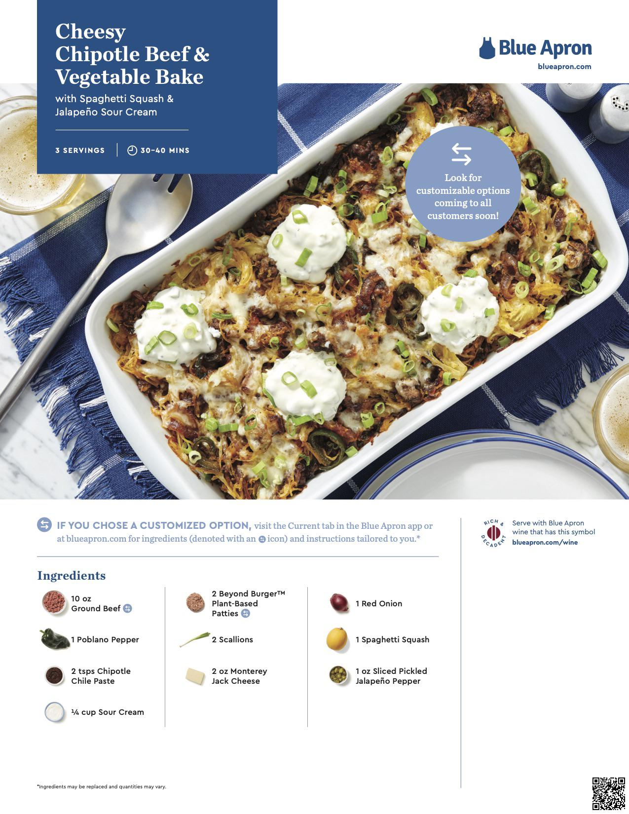

## QR Code Generator
### The purpose of this project is two-fold:
1. To create QR codes for blue apron recipes. User can opt out from receiving physical copy of recipes and instead they receive a list of QR codes that they can scan with their iphone camera, which will redirect them to the digital recipes. 
2. To create QT codes for tips and tricks. If a user needs guidance on how to properly slice an onion, they can scan the QR code on the physical copy of recipe, which will redirect them to a video of a chef showcasing how to properly slice an onion. 

### Installation
1a. Create virtual environment
```
python3 -m venv .env
source .env/bin/activate
```
1b. If using vscode, a prompt will displayed to allow you to select it for the workspace. Then run command+shift+p > select interpreter > select .env

2. Install dependencies
```
pip install -r requirements.txt
```

### Running the program
1. To create the QR codes for blue apron recipes, 
- Add recipe_name:recipe_hyperlink to recipes_links.py
- Then run:
```
python3 digital_recipes_qr_generator.py
```
- This generates the QR codes for digital recipes in the digital_recipes_qr_code/ folder. 
- Go to digital_recipes_qr_code/, select any png file, open the camera app in your phone, and hover over the QR codes. 
- As an example, hover over these two version of general tso chicken qr codes recipes:


2. To attache QR codes to a physical recipe card,
- Add tips_and_tricks_name:tips_and_tricks_hyperlink to tips_and_tricks_links.py
- Then run:
```
python3 physical_recipes_qr_generator.py
```
- This generates the QR codes for physical recipes in the physical_recipes_qr_code/folder.
- Go to physical_recipes_qr_code/, select any file with _qr_code, and hover over the QR code in the right-bottom corner.
- As an example, hover over the right-bottom QR code of the cheesy chipotle beef recipe below, and the link should take you to 'How To: Chop Scallions' Youtube link:



### Resources:
- https://note.nkmk.me/en/python-pillow-qrcode/
- https://pypi.org/project/qrcode/